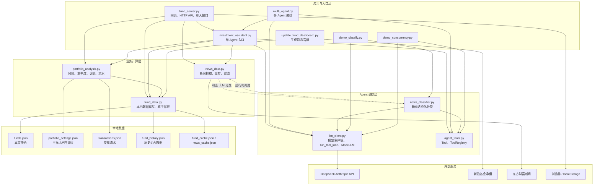
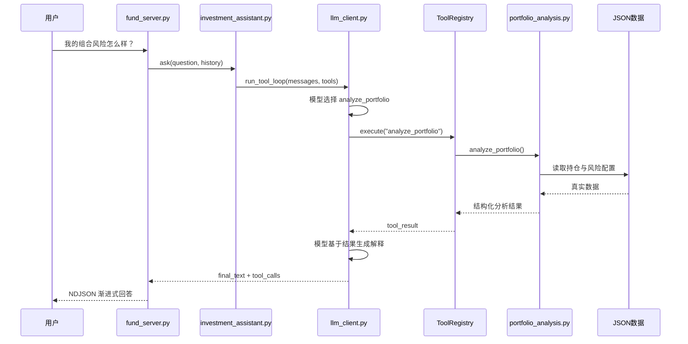

# 个人理财 Agent：项目依赖图

本文中的箭头表示“调用方依赖被调用方”。

## 文件依赖总览



## 聊天调用链路



## 文件职责

| 文件 | 直接本地依赖 | 定位 |
|---|---|---|
| `agent_tools.py` | 无 | 最底层工具抽象 |
| `llm_client.py` | 无 | 模型调用、工具循环和 MockLLM |
| `fund_data.py` | JSON 文件 | 数据访问和原子保存 |
| `portfolio_analysis.py` | `fund_data.py` | 确定性组合计算 |
| `news_data.py` | `news_classifier.py` | 新闻抓取、缓存和过滤 |
| `news_classifier.py` | `agent_tools.py`、`llm_client.py` | LLM 结构化分类 |
| `investment_assistant.py` | 工具、模型、数据、分析 | 单 Agent 业务入口 |
| `multi_agent.py` | 单 Agent、模型、工具 | 路由、专家和收敛 |
| `fund_server.py` | Agent、分析、数据、新闻 | 前端与 HTTP API |
| `update_fund_dashboard.py` | `fund_data.py` | 静态看板生成 |
| `evaluate.py` | `multi_agent.py` | Agent 路由评测 |
| `test_portfolio_analysis.py` | `portfolio_analysis.py` | 业务计算单元测试 |

## 推荐阅读顺序

```text
agent_tools.py
    ↓
llm_client.py
    ↓
fund_data.py + portfolio_analysis.py
    ↓
investment_assistant.py
    ↓
multi_agent.py
    ↓
fund_server.py
```

先理解工具抽象和 Agent 循环，再看确定性业务工具如何注册给模型，最后阅读 HTTP API 和前端。

## 当前架构注意点

`news_data.py` 和 `news_classifier.py` 存在运行时双向依赖。目前使用延迟导入避免模块初始化失败，但长期更适合抽出独立的新闻数据类型，或者让分类器不再反向依赖抓取层，从架构上消除循环依赖。

聊天接口目前使用 NDJSON 做应用层渐进式传输：工具调用和模型回答完成后，后端再分块发送文本。它不是模型原生逐 Token SSE。
